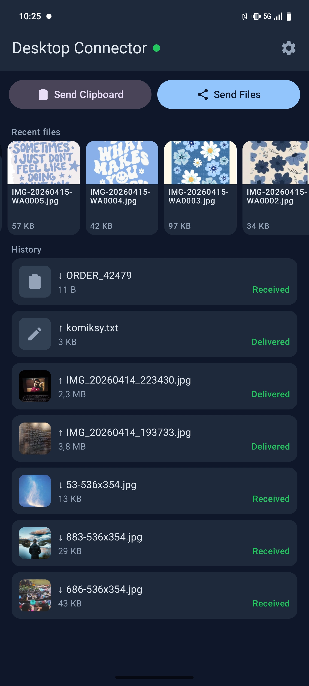
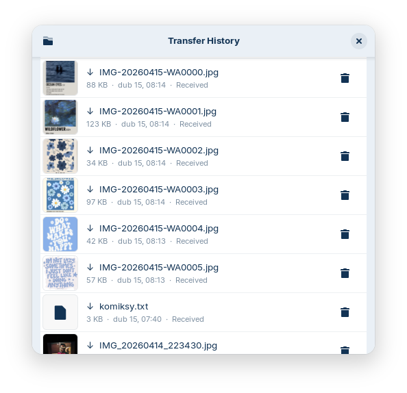

# Desktop Connector

End-to-end encrypted file and clipboard sharing between your Android phone and Linux desktop.

The relay server never sees your data — all content is encrypted on-device before it leaves, using X25519 key exchange and AES-256-GCM.

<p align="center">
  
  &nbsp;&nbsp;&nbsp;
  
</p>

## Features

- **Send files** both ways (phone to PC and PC to phone)
- **Clipboard sharing** — send text or images between devices, pushed directly to system clipboard
- **Share intent** — share any file from any Android app to your desktop
- **Recent files** strip on Android for quick sending
- **Drag and drop** on desktop to send files
- **Transfer history** with delivery status (Sent / Delivered / Received), swipe to delete
- **Offline resilient** — exponential backoff, queues transfers, catches up on reconnect
- **Zero battery drain** — Android does not poll when screen is off, polls immediately on wake
- **Unpair syncs both sides** — unpair from either device, the other side reacts automatically
- **APK install** — send APK to phone, tap to install with permission handling
- **Self-hosted relay** — run your own PHP server on any PHP 8.0+ hosting
- **One-command install** — idempotent installer with dependency checking

## Install (Linux Desktop)

```bash
curl -fsSL https://raw.githubusercontent.com/hawwwran/desktop-connector/main/desktop/install.sh | bash
```

Then run `desktop-connector` or find it in your app menu.

To uninstall:
```bash
~/.local/share/desktop-connector/uninstall.sh
```

## Install (Android)

Download the APK from [Releases](../../releases) and install it on your phone.

## Setup

1. Start the desktop app — it will show a QR code
2. Open the Android app — scan the QR code
3. Verify the pairing code matches on both screens
4. Done — start sending files and clipboard

## Server

The relay server is a PHP app that stores only encrypted blobs. It never sees your files or clipboard content.

### Self-hosting

Upload the `server/` directory to any PHP 8.0+ hosting with SQLite support. See [CLAUDE.md](CLAUDE.md) for deployment details.

### Local development

```bash
php -S 0.0.0.0:4441 -t server/public/
```

## How it works

```
[Android Phone]                [PHP Relay Server]              [Linux Desktop]
     |                               |                              |
     |  -- encrypted upload -->      |                              |
     |                               |  <-- poll for pending ---    |
     |                               |  --- encrypted download -->  |
     |                               |                              |
     |  X25519 keypair               |  Sees only device IDs       |  X25519 keypair
     |  AES-256-GCM encrypt          |  + encrypted blobs          |  AES-256-GCM decrypt
```

- **Pairing**: Desktop shows QR code with its public key. Phone scans it. Both derive a shared secret via X25519 + HKDF. Verification code confirms the keys match.
- **Transfers**: Files are chunked (2MB), encrypted with AES-256-GCM, uploaded to the relay. The other side polls, downloads, decrypts.
- **Clipboard**: Uses the `.fn.clipboard.text` / `.fn.clipboard.image` naming convention to signal the receiver to push content to the system clipboard instead of saving a file.
- **Delivery tracking**: Server tracks download status. Sender polls to update "Sent" to "Delivered".

## Security

| What the server sees | What the server does NOT see |
|---|---|
| Device IDs (public key fingerprints) | File contents |
| Which devices are paired | Filenames, sizes, types |
| Approximate file size (chunk count) | Clipboard content |
| Timing of transfers | Encryption keys |

## Roadmap

See [docs/ROADMAP.md](docs/ROADMAP.md) for planned features.

## License

MIT
